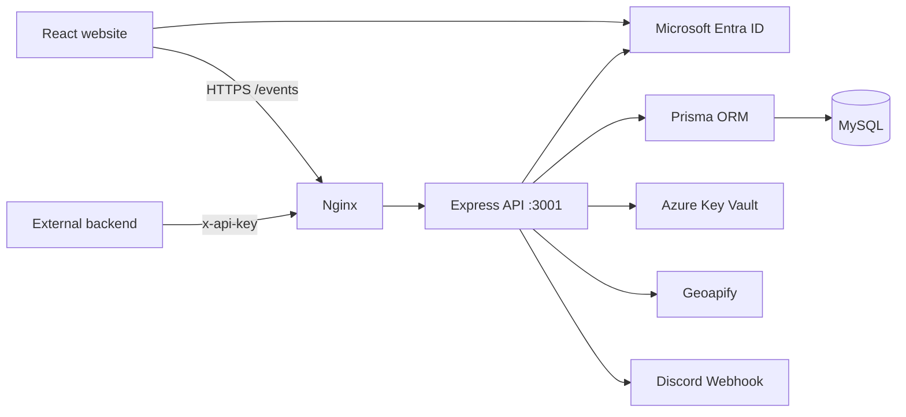

# Campus Event Management and Booking API

[](https://github.com/kayos4326/campus-event-management-booking-api/actions/workflows/ci.yml)

We built this project for CSX4110 Backend Application Development, semester 1/2026.
It lets AU students find campus events and reserve seats. Organizers create the events,
and admins manage the system.

**Live site:** https://chaotic-hell.eastasia.cloudapp.azure.com/events/

Team members:

- Thar Lin Htet (6642062)
- Honey Linn (6726113)
- Mi Hsu Myat Win Myint (6726115)

## Main features

### Student

- Sign in with an AU Microsoft account
- Browse published events
- Book a seat or join the waitlist when an event is full
- Cancel a booking
- Move automatically from the waitlist when a seat becomes free

### Organizer

- Add a venue by dropping a pin on the campus map
- Create, edit, publish and cancel events
- Set the event capacity and upload a cover photo
- View attendees and event history
- Request any type and quantity of event supplies

### Admin

- View all users, events and bookings
- Change user roles
- View the activity log
- Create and revoke API keys for the room-status endpoint

## How the system is built

- **Frontend:** React and Vite
- **Backend:** Node.js and Express
- **Database:** MySQL with Prisma ORM and migrations
- **Login:** Microsoft Entra ID using OAuth/OIDC and JWT access tokens
- **Secrets:** Azure Key Vault
- **Hosting:** Azure Linux VM, Nginx, HTTPS and PM2
- **External APIs:** Geoapify and Discord Webhooks



The browser gets an access token from Microsoft after login. The API checks the token
and the user's role before handling a request. Prisma is used for all database work.

Bookings use a database transaction and lock the event row. This prevents two students
from taking the same last seat. Discord supply messages are stored as jobs first, so they
can be retried if Discord is temporarily unavailable.

## Azure Key Vault

Production secrets are not stored in the repository or in the production `.env` file.
The VM uses its managed identity to read these values from Azure Key Vault when the app starts:

- MySQL connection URL
- Geoapify API key
- Discord webhook URL

The Entra tenant ID, client ID and Key Vault URL are bootstrap settings, not passwords.
Microsoft signs the JWT access tokens, so this project does not need its own JWT signing secret.

## Prisma database

The database structure is defined in `prisma/schema.prisma`. It includes users, venues,
events, bookings, event images, supply requests, API keys, audit logs and outbox jobs.

Changes to the database are kept in `prisma/migrations/`. Deployment runs
`prisma migrate deploy` before starting a new release.

## External APIs

### Geoapify

Geoapify is used when an organizer creates a venue. It searches for campus places and
turns a selected map pin into a readable address. The API key comes from Key Vault.

### Discord Webhook

When an organizer publishes an event with a supply request, the backend posts the item,
quantity and event details to Discord. The webhook URL stays in Key Vault and is never
sent to the browser.

## Peer API

### API we consume

Our proposal listed the University E-Commerce and Merchandise Store (Option 1) as our
partner API. We planned to send supply orders to it, but its order endpoint was not
finalized. The teacher later told us to use a public API, so the current build sends these
requests to Discord instead.

The current build therefore does **not** consume a classmate's API. Discord is a public
third-party API, not a peer API.

### API we expose

Another backend can check whether an event is active in a room:

```http
GET /events/api/peer/events/active?room=301
x-api-key: <key issued by an Admin>
```

The key needs the `room-status:read` scope. Admins create and revoke these keys in the
Admin page. Only the SHA-256 hash is saved in MySQL, and the original key is shown once.

Example response:

```json
{
  "active": true,
  "eventId": 42,
  "title": "CSX4110 Capstone Demo Day",
  "endsAt": "2026-09-20T09:00:00.000Z"
}
```

If there is no active event, the endpoint returns:

```json
{ "active": false }
```

This endpoint is read-only. An invalid or revoked key gets `401 Unauthorized`.

## Run with Docker

Requirements:

- Git
- Docker Desktop with Docker Compose

```bash
git clone https://github.com/kayos4326/campus-event-management-booking-api.git
cd campus-event-management-booking-api
docker compose up --build
```

Open http://localhost:3001/events/. The health check is available at
http://localhost:3001/health.

Docker starts MySQL, applies the migrations, builds the frontend and starts the API.
The local database credentials in `docker-compose.yml` are only for development.

Microsoft login only works on registered redirect URLs. The current registration points
to the live site, so use the live site when demonstrating login and role-based features.

Stop the containers with:

```bash
docker compose down
```

## Run without Docker

You need Node.js 18.18 or newer and MySQL 8.

1. Copy `.env.example` to `.env`.
2. Add local values for `DATABASE_URL` and `GEOAPIFY_API_KEY`.
3. Keep real secrets out of Git.
4. Run:

```bash
npm ci
npx prisma generate
npx prisma migrate deploy
cd frontend-ui
npm ci
npm run build
cd ..
npm start
```

## Deployment

The app is deployed under `/events`, so it does not interfere with the existing `/api`
and `/content` routes on the same VM.

```bash
./deploy.sh
./deploy.sh rollback
./deploy.sh releases
```

The deployment script builds the frontend, backs up the database, applies migrations and
checks the new release before switching traffic to it. If the health check fails, it returns
to the previous release.

GitHub Actions checks the Prisma schema and migrations, frontend build, deployment scripts
and Docker image on every push.

## Project folders

```text
src/            Express routes, middleware and services
prisma/         Prisma schema and migrations
frontend-ui/    React frontend
scripts/        Server-side deployment script
```

To create a small source-code zip without installed packages:

```bash
git archive --format=zip HEAD -o campus-events.zip
```
