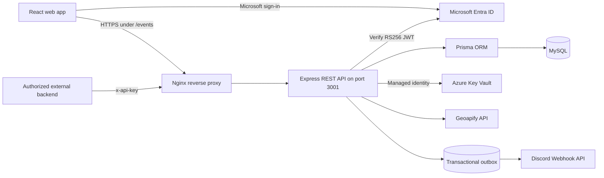

# Campus Event Management and Booking API

[](https://github.com/kayos4326/campus-event-management-booking-api/actions/workflows/ci.yml)

Book seats at university events. Organizers publish events, students reserve a seat (or join
the waitlist when it's full), and admins look after people and access.

**Live:** https://chaotic-hell.eastasia.cloudapp.azure.com/events/ — sign in with your AU
Microsoft account.

CSX4110 Backend Application Development, semester 1/2026 — Thar Lin Htet (6642062),
Honey Linn (6726113), Mi Hsu Myat Win Wyint (6726115).

## What it does

- **Students** browse published events, book or join the waitlist, and cancel. When someone
  cancels, the next person on the waitlist gets the seat automatically.
- **Organizers** create events with a venue (dropped as a pin on a map), a capacity, a cover
  image and an optional supply order ("200 × lanyards") that's posted to the team's Discord.
- **Admins** manage roles, see all events and bookings, read the activity log, and issue API
  keys for the public room-status endpoint.

## Architecture overview

Node.js + Express, MySQL through Prisma, and a React (Vite) frontend served by the same app.
Sign-in is Microsoft Entra ID: the API verifies Microsoft's tokens and checks roles on every
request. Secrets live in Azure Key Vault. It runs on an Azure VM behind Nginx under PM2.



| Component | Responsibility |
|---|---|
| React and Vite | Student, Organizer and Admin user interface |
| Express | REST routes, validation, authorization and business rules |
| Microsoft Entra ID | University sign-in and signed JWT access tokens |
| Prisma and MySQL | Relational data, transactions and versioned migrations |
| Azure Key Vault | Production database URL, Geoapify key and Discord webhook URL |
| Geoapify | Campus-place search and reverse geocoding for map pins |
| Discord webhook | Receives event supply requests |
| Nginx and PM2 | HTTPS reverse proxy and production process management |

The main request flow is: the browser signs in through Microsoft, sends the access token to
Express, and the API verifies the token and role before using Prisma. A booking transaction
locks its event row, preventing concurrent students from taking the same final seat. Supply
requests are committed with an outbox job and delivered to Discord with retries, so a temporary
Discord outage does not lose the request.

Things worth knowing before you change something:

- Booking runs inside a transaction that locks the event row, so two people can't take the
  last seat at the same time.
- Every request body is checked against a schema in `src/validation/schemas.js`.
- Work that has to happen after a change, like posting a supply order to Discord, goes
  through an outbox (`src/services/outbox.js`): it's saved with the change and retried until
  it goes through.

## External and peer API documentation

### Public APIs consumed by this project

**Geoapify** is called by the backend to search for university locations and reverse-geocode a
latitude/longitude pin into a readable venue address. The response data used is the formatted
address, coordinates and place metadata. Its API key is loaded from Azure Key Vault at runtime.

**Discord Webhook API** receives an organizer's supply request after an event is published. The
backend sends the event title, event ID, capacity, requested item and quantity. Discord returns a
message ID, which is saved as the supply order reference. Delivery uses the transactional outbox
and automatic retries. The private webhook URL is loaded from Azure Key Vault and is never returned
to the frontend.

### Classmate API consumed

The submitted proposal named the **University E-Commerce and Merchandise Store (Option 1) team**
as the classmate API provider. The intended action was to create a merchandise order when an event
needed supplies. That team's order-creation contract was never finalized, so there is no classmate
endpoint or classmate-issued API key in the current code.

Following the instructor's verbal scope change on 10 September 2026, the live implementation uses
the Discord Webhook API for the same supply-request workflow. Therefore, the current project
**does not consume a classmate's API**. Discord is a genuine public third-party API, not a peer API.
If the written peer requirement is enforced instead of that verbal amendment, a real classmate
endpoint must be connected before final submission; this README deliberately does not claim an
integration that is not implemented.

### API exposed for another backend

The project exposes a room-status endpoint originally designed for the class HelpDesk/Ticketing
team. It reports whether a published event is currently active in a room.

```http
GET /events/api/peer/events/active?room=301
x-api-key: <key issued by an Admin>
```

The key must have the `room-status:read` scope. An Admin issues or revokes keys in the Admin area.
The raw key is displayed only once; the database stores only its SHA-256 hash.

Active-event response:

```json
{
  "active": true,
  "eventId": 42,
  "title": "CSX4110 Capstone Demo Day",
  "endsAt": "2026-09-20T09:00:00.000Z"
}
```

When no event is active in that room:

```json
{ "active": false }
```

Missing, invalid or revoked keys receive `401 Unauthorized`; a missing room query receives
`400 Bad Request`. The endpoint is read-only and never creates, changes or deletes application
data.

## Setup instructions

### Prerequisites

- Docker Desktop with Docker Compose (recommended), or Node.js 18.18+ and MySQL 8
- Git for cloning the repository
- An AU Microsoft account for the deployed site's sign-in

Clone the repository:

```bash
git clone https://github.com/kayos4326/campus-event-management-booking-api.git
cd campus-event-management-booking-api
```

### Recommended local setup with Docker

Start the complete local stack (Express, built React frontend and MySQL):

```bash
docker compose up --build
```

Open http://localhost:3001/events/ and verify the API at
http://localhost:3001/health. Docker creates the local database and applies every Prisma migration.
The local database credentials in `docker-compose.yml` are disposable development values, not
production credentials.

The page and API run locally, but Microsoft sign-in does not complete because `localhost` is not a
registered redirect URI for the production Entra application. Use the live site for an authenticated
demonstration.

Stop the stack with:

```bash
docker compose down
```

Use `docker compose down -v` only when you intentionally want to delete the local database volume.

### Backend without Docker

Copy `.env.example` to `.env`, keep the tenant/client/vault bootstrap values, and provide local
development values for `DATABASE_URL` and `GEOAPIFY_API_KEY`. `DISCORD_WEBHOOK_URL` is optional.
Never commit `.env` or a real key.

```bash
npm ci
npx prisma generate
npx prisma migrate deploy
cd frontend-ui
npm ci
npm run build
cd ..
npm start
```

Open http://localhost:3001/events/.

### Frontend development

```bash
cd frontend-ui
npm ci
npm run dev
```

This talks to the live API, so you see real data — but you can't sign in from `localhost`:
that address isn't registered with Microsoft (see below). Thar can add it to the Entra app
registration if local sign-in is needed.

## Running it from a zip (marking, or a teammate with no access)

Everything needed is in the repository — no secrets, no Azure access:

```bash
docker compose up --build        # the whole stack, then http://localhost:3001/events/
```

This was checked from a fresh unpacked zip: Docker creates the database, applies all seven
migrations and serves the app.

**Signing in only works on the live site.** Microsoft only returns people to web addresses
registered on our Entra app, and only `https://chaotic-hell.eastasia.cloudapp.azure.com/events/`
is registered — `localhost` is not (verified against Microsoft's sign-in service). So a local
copy shows the sign-in page and the API correctly answers 401, but you can't sign in to it. To
see the app in use, use the live site. A first-time visitor signs in as a Student; an admin can
change that from the Admin tab.

To make a zip without the installed packages:

```bash
git archive --format=zip HEAD -o campus-events.zip
```

## Deploying

Needs the VM's SSH key and Azure CLI access to the Key Vault.

```bash
./deploy.sh                # build, check, back up + migrate, switch to a new release
./deploy.sh rollback       # back to the release that was live before
./deploy.sh releases       # what's on the server
```

A new release is started on a spare port and checked before any user reaches it; if it's
unhealthy after the switch, the previous release comes back on its own. Rollback changes code
only, so migrations must keep working with the release before them (add, don't rename or
drop). Commit before deploying — the release is named after the commit.

CI (GitHub Actions) installs the app and generates its Prisma client, applies every migration
to an empty MySQL and checks the migrations match the schema, lints and builds the frontend,
runs ShellCheck over the deploy scripts, and builds the Docker image.

## Where things are

```
src/            API: routes/, services/ (bookings, outbox, Discord, images), validation/
prisma/         schema and migrations
frontend-ui/    React app
scripts/        the part of the deploy that runs on the VM
```

The automated test suites, the submitted proposal and the detailed project notes are kept
outside this repository; this one holds what is needed to build, run and deploy the app.
