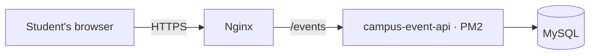

# Splitting the remaining work

Thar wrote the code so far, so every commit is his. The honest way for Honey and Mi Hsu to
appear as contributors is to do real work and commit it themselves — the tasks below are
genuinely left to do, and each one is useful on its own.

## How GitHub decides who contributed

GitHub reads the **author** of each commit and matches it to a GitHub account by email. So the
only thing that matters is that your commits carry *your* email — the one on your GitHub
account. If you pair on something, add the other person as a co-author (last lines of the
commit message, after a blank line):

```
Co-authored-by: Honey Linn <her-github-email@example.com>
```

Co-authors get credit too: they show on the commit and count as contributors.

## One-time setup (each person, on your own laptop)

```bash
git clone <the repository URL>
cd campus-event-api
git config user.name "Your Name"          # as you want it shown
git config user.email "your-github-email" # must match your GitHub account
npm install && npm test                    # 204 tests should pass — proves your setup works
```

Find the right email at GitHub → Settings → Emails. If you'd rather not publish your address,
use the `…@users.noreply.github.com` one shown there.

## How to do a task

```bash
git checkout main && git pull
git checkout -b short-name-of-your-task
# ... make the change ...
npm test                    # must still pass
git add -A
git commit -m "A sentence saying what changed, and why"
git push -u origin short-name-of-your-task
```

Then open a pull request on GitHub and ask Thar to review it. Small, finished pieces are better
than one big one — three real commits look like three real contributions, because they are.

---

## Honey

### 1. Bring `docs/proposal.md` in line with what we actually built
The submitted proposal still describes things we changed during the project. Go through it and
correct, marking each change so it's clear it was deliberate:

| It says | What we did |
|---|---|
| Mapbox, static map images | Leaflet + OpenStreetMap; the organizer drops a pin, Geoapify turns it into an address |
| A fixed 50 blank lanyards | The organizer chooses the item and the amount |
| Calling the Merch team's API | A Discord webhook, after the teacher dropped the peer-API ring (CLAUDE.md §5) |
| A JWT signing secret in Key Vault | There isn't one — Microsoft signs the tokens, we only verify them |
| Peer API keys in Key Vault | Keys we issue are stored hashed in the database |

Keep the original wording where it's still true. `CLAUDE.md` explains every change and why.

### 2. Tests for the booking rules
`tests/integration/bookings.test.js` covers the main paths. Add cases for situations a marker
might try:
- booking an event that has already ended
- cancelling a booking twice
- a second student booking the same event while one seat remains

Follow the style of the tests already there. `npm test` must stay green.

### 3. Write the "how we tested it" section of the report
The numbers are in `CLAUDE.md` (§8 and §9) and `tests/e2e/README.md`: 204 automated tests, plus
end-to-end runs that drive a real browser, and the booking race proven both ways against the
real database. Explain what was tested and why it mattered — not just the totals.

---

## Mi Hsu

### 1. A deployment diagram
The teacher's brief asks for one. Add `docs/deployment.md` with a diagram of: browser →
Nginx (HTTPS, `/events`) → this app under PM2 → MySQL, plus Entra ID for sign-in, Key Vault for
secrets, Geoapify and Discord on the outside, and the other two sites (`/content`, `/api`) on the
same machine. GitHub renders Mermaid diagrams, so this works:

````

````

`CLAUDE.md` §3 has the real details — ports, paths and what runs where.

### 2. Tests for what the API refuses
`tests/integration/validation.test.js` shows the pattern. Add cases for input a marker would try:
- a venue with a pin in the sea (latitude 0, longitude 0)
- a supply order with a negative amount
- an event whose title is only spaces

### 3. Screenshots for the README
After the video is recorded, take clean screenshots of Discover, an event with its cover image,
and the organizer's page. Put them in `docs/screenshots/` and add them to `README.md` — right now
someone reading the repo can't see what the app looks like.

---

## Checking it worked

After the pull requests are merged, the repository's **Insights → Contributors** page should show
all three of you. If someone is missing, their commits used an email GitHub doesn't recognise —
fix the email in `git config` and it applies to later commits.
